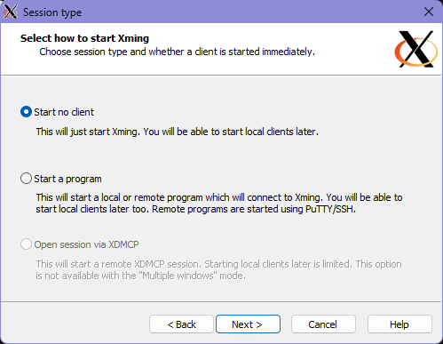

## 🏆 CUB3D
Cub3D is a first-person 3D simulation project inspired by Wolfenstein 3D, developed as part of the 42 Coding School curriculum. At its core, the project features a raycasting engine, entirely written in C, which renders a 3D environment based on a 2D map input.

A key feature of Cub3D is dynamic map generation—you can provide any custom .cub map file, and the game will interpret it in real time. The raycasting algorithm processes the map layout, textures, and player spawn position to generate a realistic first-person perspective of the environment. The rendering adapts dynamically, ensuring that what the player sees is a direct simulation of the given map file.

By implementing the raycasting engine from scratch, this project provides a deep understanding of graphical rendering, linear algebra, and game development principles, all while maintaining efficient performance in C.

Here is a demonstration of the dynamic map generation feature mentioned above. The game adapts to any valid .cub map file provided, rendering the environment accordingly. Additionally, you can create your own custom .cub map to test and explore different level designs.

<p align="center">
  <a href="https://www.youtube.com/watch?v=3QXR1Fd46A4">
    
  </a>
</p>

<p align="center">
  <b>▶ Click the image to watch the video</b>
</p>

## Table of Contents

- [🏆 Cub3D](#-42-school---cub3d)
- [🚀 Features](#-features)
- [🛠️ Installation & Usage](#️-installation--usage)
  - [Prerequisites](#prerequisites)
  - [Installation](#installation)
  - [Running the Game](#running-the-game)
- [🖥️ Setting Up Xming](#️-setting-up-xming)
- [🎮 Controls](#-controls)
- [📜 Map Configuration](#-map-configuration)
- [🏗️ Project Structure](#️-project-structure)
- [📌 Learning Outcomes](#-learning-outcomes)
- [📜 Credits](#-credits)

## 🚀 Features

- Raycasting engine for 3D rendering ( Written in C )
- Dynamic map generation: The game supports flexible map designs
- Wall, floor, and ceiling textures
- Player movement and rotation
- Basic collision detection

## 🛠️ Installation & Usage

### Prerequisites

- macOS or Linux
- `gcc`
- MinilibX (included in the repository)
- [Download Xming](https://sourceforge.net/projects/xming/) (Required for running on Windows)

### Compilation
#### Install X11 dependencies (Linux)
```bash
sudo apt-get install libx11-dev libxext-dev
```
This ensures that the necessary X11 dependencies are installed for proper execution of the project.

```bash
git clone git@github.com:hanzong111/CUB3D.git
cd cub3d
make
```

## 🖥️ Setting Up Xming

Before running `./cub3d`, ensure that Xming is properly configured and running. Follow these steps:

1. **Select Display Settings**
   
   - Choose **Multiple windows**.
   - Set **Display number** to `0`.
   - Click **Next**.

2. **Select Session Type**
   
   - Choose **Start no client**.
   - Click **Next**.

3. **Additional Parameters**
   
   - Enable **Clipboard**.
   - Click **Next**.

4. **Finish Configuration**
   
   - Click **Finish** to start Xming.

Once Xming is running, proceed with executing `./cub3d`.

### Running the Game
#### Choosing a Map
Inside the `maps` directory, there are multiple predefined `.cub` files, each offering a unique gameplay experience. You can choose any of these maps when launching the game:

```bash
./cub3d maps/maze.cub  # Standard maze
./cub3d maps/omega.cub  # A map that is very big in size
./cub3d maps/small.cub  # A very small map 
```
#### Running the game 

```bash
./cub3d maps/maze.cub
```

## 🎮 Controls

| Key         | Action       |
|------------|-------------|
| W / ↑      | Move forward |
| S / ↓      | Move backward |
| A / ←      | Strafe left  |
| D / →      | Strafe right |
| Left Arrow | Rotate left  |
| Right Arrow| Rotate right |
| ESC        | Quit the game |

## 📜 Map Configuration

The `.cub` map file follows a specific structure:

- First lines define textures and colors:
  ```
  NO ./textures/wall_north.xpm      # North Wall Textures
  SO ./textures/wall_south.xpm      # South Wall Textures
  WE ./textures/wall_west.xpm       # West Wall Textures
  EA ./textures/wall_east.xpm       # East Wall Textures
  F 220,100,50                      # Floor Color
  C 225,225,225                     # Ceiling Color
  ```
- Followed by the map using `1` for walls and `0` for open spaces:
  ```
  111111
  100001
  10N001
  100001
  111111
  ```
  `N`, `S`, `E`, or `W` represents the player starting position and initial facing direction.

## 🏗️ Project Structure

```
📂 cub3d
├── 📂 srcs         # Source code
├── 📂 includes    # Header files
├── 📂 maps        # Example map files
├── 📂 sprites    # Texture assets
├── Makefile      # Compilation script
└── README.md     # Project documentation
```

## 📌 Learning Outcomes

- Understanding of raycasting algorithms
- Using MinilibX for graphical applications
- Handling file parsing and memory management in C
- Working with game loop logic and event handling

## 📜 Credits

Project developed as part of 42 Coding School curriculum.

👤 **Ong Jing Hanz**

📌 [GitHub](https://github.com/hanzong111) | 📧 [Email](mailto:hanzong111@gmail.com)
